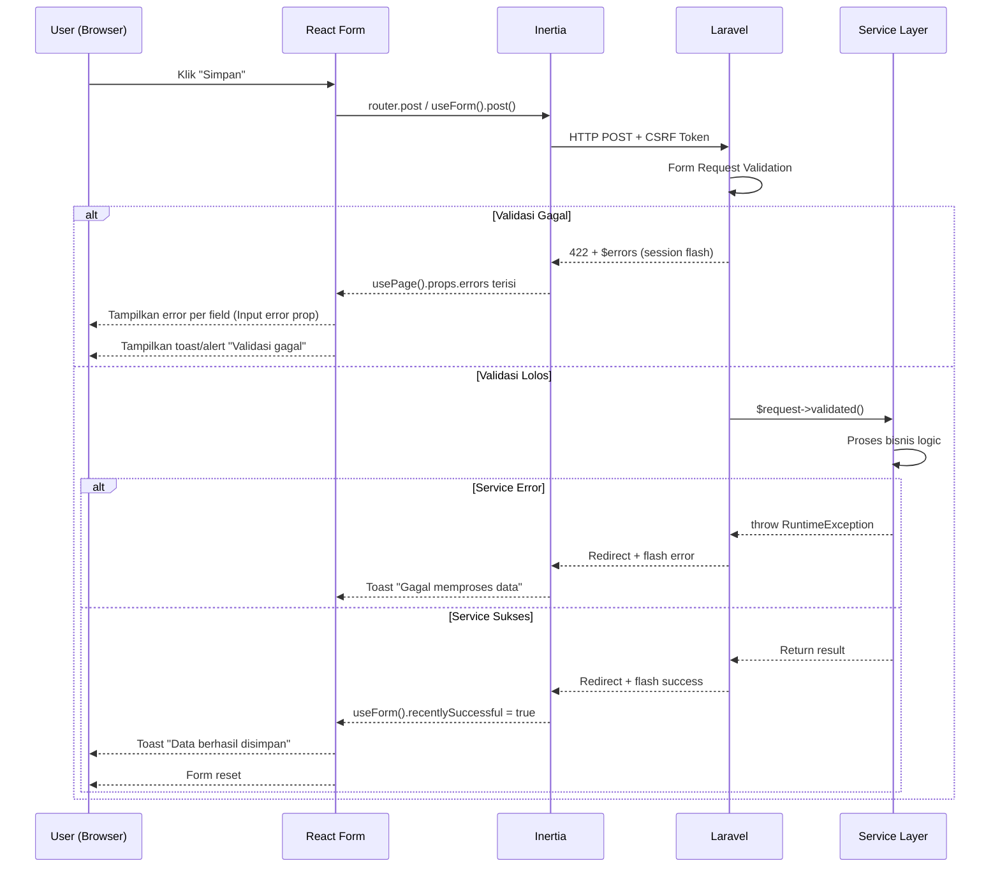

# Panduan Error Handling Patterns — SMART Absen SMA UII

> Dokumen ini melengkapi [`development-workflow.md`](development-workflow.md). Fokusnya pada **pola runtime error handling** di sisi frontend, backend, dan full-stack — mulai dari validasi form, error boundary, flash messages, hingga persiapan API error contract untuk pemisahan frontend/backend.
>
> Dibaca **setelah** memahami `development-workflow.md` (terutama section 3-5 tentang tooling dan monitoring).

---

## Daftar Isi

1. [Pendahuluan](#1-pendahuluan)
2. [Backend Error Handling Patterns](#2-backend-error-handling-patterns)
   - 2.1. Form Request Validation Flow
   - 2.2. Custom Exception Handler
   - 2.3. HTTP Error Pages (403, 404, 419, 500)
   - 2.4. Queue Failure Handling
   - 2.5. API Error Response Format
3. [Frontend Error Handling Patterns](#3-frontend-error-handling-patterns)
   - 3.1. React Error Boundary
   - 3.2. Inertia `useForm()` + Validation Errors
   - 3.3. Flash Messages / Toast Notification
   - 3.4. Global Inertia Event Handlers
   - 3.5. Frontend Logging Strategy
   - 3.6. Network Error & Offline Detection
4. [Full-Stack Error Flow](#4-full-stack-error-flow)
   - 4.1. Validation Error Flow (Diagram)
   - 4.2. Session Timeout (419)
   - 4.3. API Error Contract (Future Separation)
5. [Checklist Implementasi](#5-checklist-implementasi)

---

## 1. Pendahuluan

### 1.1. Tujuan

Dokumen ini menjawab pertanyaan: **"Apa yang terjadi ketika error terjadi di runtime, dan bagaimana setiap layer menanganinya?"**

`development-workflow.md` berfokus pada **pencegahan** (prevent before runtime via tooling). Dokumen ini berfokus pada **penanganan** saat error benar-benar terjadi.

### 1.2. Target Pembaca

| Peran | Nama | Fokus |
|---|---|---|
| Project Manager & Lead Developer | sandikodev | Arsitektur error handling, review pattern |
| Learning Mentor | Azis | Review implementasi, mentoring |
| Junior Frontend Developer | Fathan Mubina | React Error Boundary, Inertia errors, flash messages |
| Junior Backend Developer | Ihsan | Exception handler, HTTP error pages, API format |
| Junior Frontend Developer | Hanif | Toast, form validation UI, error boundary |

### 1.3. Prasyarat

Sebelum membaca dokumen ini, pastikan sudah memahami:

- **[development-workflow.md](development-workflow.md)** section 3 (Laravel Tooling) dan section 4 (Frontend Tooling)
- **Dual Controller Pattern** — Web vs API controller
- **Service Layer Pattern** — Controller tipis, Service tebal
- **InertiaJS** — `useForm()`, `usePage()`, `router`

---

## 2. Backend Error Handling Patterns

### 2.1. Form Request Validation Flow

**Apa itu?**  
Laravel Form Request adalah tempat validasi input. Jika validasi gagal, Laravel otomatis mengembalikan response 422 dengan error messages. Di Inertia, errors ini otomatis tersedia di `usePage().props.errors`.

**Flow:**
```
Browser (form submit)
    │ POST /admin/data-master/siswa
    ▼
StoreSiswaRequest (validasi)
    │
    ├── Gagal ──→ 422 + $errors (dalam session)
    │                 │
    │                 ▼
    │           Inertia otomatis kirim errors ke komponen React
    │           usePage().props.errors  ← otomatis terisi
    │           useForm().errors        ← otomatis terisi
    │
    └── Lolos ──→ Controller → Service → Database
                      │
                      ▼
                200 + redirect + flash message
```

**Contoh Form Request:**
```php
<?php
// app/Http/Requests/StoreSiswaRequest.php

namespace App\Http\Requests;

use Illuminate\Foundation\Http\FormRequest;

class StoreSiswaRequest extends FormRequest
{
    public function authorize(): bool
    {
        return true; // Policy check bisa di sini
    }

    public function rules(): array
    {
        return [
            'nis' => 'required|string|max:20|unique:students,nis',
            'nisn' => 'required|string|max:20|unique:students,nisn',
            'name' => 'required|string|max:255',
            'class_id' => 'nullable|exists:school_classes,id',
            'email' => 'nullable|email|max:255|unique:users,email',
            'password' => 'nullable|string|min:8',
        ];
    }

    public function messages(): array
    {
        return [
            'nis.required' => 'NIS harus diisi.',
            'nis.unique' => 'NIS sudah terdaftar.',
            'nisn.required' => 'NISN harus diisi.',
            'nisn.unique' => 'NISN sudah terdaftar.',
            'name.required' => 'Nama siswa harus diisi.',
            'password.min' => 'Password minimal 8 karakter.',
        ];
    }
}
```

**Cara Pakai di Controller:**
```php
// app/Http/Controllers/Web/DataMasterController.php
public function storeSiswa(StoreSiswaRequest $request)
{
    $data = $request->validated(); // ← hanya data yang sudah divalidasi
    $student = $this->studentService->create($data);

    return redirect()->back()->with('success', 'Siswa berhasil ditambahkan.');
}
```

**Yang SUDAAH beres:**
- ✅ `useForm()` di `DataMaster.tsx` sudah menangani errors otomatis
- ✅ Belum ada implementasi form tambah siswa — perlu dibuat

### 2.2. Custom Exception Handler

**Apa itu?**  
`app/Exceptions/Handler.php` adalah pusat kendali semua exception Laravel. Di sini kita tentukan response apa yang dikembalikan untuk setiap jenis exception.

**Yang perlu dikonfigurasi:**
```php
<?php
// app/Exceptions/Handler.php

namespace App\Exceptions;

use Illuminate\Foundation\Exceptions\Handler as ExceptionHandler;
use Illuminate\Validation\ValidationException;
use Symfony\Component\HttpKernel\Exception\NotFoundHttpException;
use Symfony\Component\HttpKernel\Exception\HttpException;
use Illuminate\Auth\AuthenticationException;
use Illuminate\Auth\Access\AuthorizationException;
use Illuminate\Session\TokenMismatchException;
use Throwable;

class Handler extends ExceptionHandler
{
    protected $dontReport = [
        // Exception yang tidak perlu di-log
    ];

    protected $dontFlash = [
        'password',
        'password_confirmation',
    ];

    public function register(): void
    {
        $this->reportable(function (Throwable $e) {
            // Log otomatis sudah ditangani Laravel
        });

        // ─── Response untuk Inertia ───

        $this->renderable(function (NotFoundHttpException $e, $request) {
            if ($request->inertia()) {
                return redirect()->back()->with('error', 'Data tidak ditemukan.');
            }
            // API response
            if ($request->expectsJson()) {
                return response()->json([
                    'success' => false,
                    'message' => 'Resource not found.',
                ], 404);
            }
        });

        $this->renderable(function (AuthorizationException $e, $request) {
            if ($request->inertia()) {
                return redirect()->back()->with('error', 'Anda tidak memiliki izin untuk aksi ini.');
            }
            if ($request->expectsJson()) {
                return response()->json([
                    'success' => false,
                    'message' => 'Forbidden.',
                ], 403);
            }
        });

        $this->renderable(function (TokenMismatchException $e, $request) {
            if ($request->inertia()) {
                return redirect()->route('login')->with('error', 'Sesi berakhir. Silakan login ulang.');
            }
        });

        $this->renderable(function (AuthenticationException $e, $request) {
            if ($request->inertia()) {
                return redirect()->route('login');
            }
        });
    }
}
```

**Catatan:** File ini sudah ada secara default di Laravel. Yang perlu dilakukan adalah menambahkan `renderable` closure untuk Inertia-specific response.

### 2.3. HTTP Error Pages (403, 404, 419, 500)

**Apa itu?**  
Halaman kustom untuk HTTP error codes. Tanpa ini, Laravel menampilkan stack trace mentah (jika `APP_DEBUG=true`) atau halaman putih polos (jika `APP_DEBUG=false`).

**Yang perlu dibuat:**
```
resources/views/errors/
├── 403.blade.php      # Forbidden
├── 404.blade.php      # Not Found
├── 419.blade.php      # Session Expired
└── 500.blade.php      # Server Error
```

**Template dasar (gunakan yang sudah ada di Laravel starter):**
```blade
{{-- resources/views/errors/404.blade.php --}}
<!DOCTYPE html>
<html lang="id">
<head>
    <meta charset="UTF-8">
    <meta name="viewport" content="width=device-width, initial-scale=1.0">
    <title>404 — Halaman Tidak Ditemukan</title>
    @vite('resources/css/app.css')
</head>
<body class="bg-background font-sans">
    <div class="min-h-screen flex items-center justify-center p-4">
        <div class="text-center max-w-md">
            <h1 class="text-[72px] font-bold text-primary font-brand">404</h1>
            <h2 class="text-[20px] font-bold text-text-primary font-inter mb-2">
                Halaman Tidak Ditemukan
            </h2>
            <p class="text-[14px] text-text-muted font-inter mb-6">
                Halaman yang Anda cari tidak tersedia atau telah dipindahkan.
            </p>
            <a href="{{ url('/dashboard') }}"
               class="inline-block bg-primary text-white px-6 py-3 rounded-lg font-inter font-semibold text-[14px] hover:bg-primary/90 transition-colors">
                Kembali ke Dashboard
            </a>
        </div>
    </div>
</body>
</html>
```

```blade
{{-- resources/views/errors/419.blade.php --}}
<!DOCTYPE html>
<html lang="id">
<head>
    <meta charset="UTF-8">
    <meta name="viewport" content="width=device-width, initial-scale=1.0">
    <title>419 — Sesi Berakhir</title>
    @vite('resources/css/app.css')
</head>
<body class="bg-background font-sans">
    <div class="min-h-screen flex items-center justify-center p-4">
        <div class="text-center max-w-md">
            <h1 class="text-[72px] font-bold text-warning font-brand">419</h1>
            <h2 class="text-[20px] font-bold text-text-primary font-inter mb-2">
                Sesi Berakhir
            </h2>
            <p class="text-[14px] text-text-muted font-inter mb-6">
                Halaman kedaluwarsa karena terlalu lama tidak digunakan. Silakan muat ulang halaman.
            </p>
            <a href="{{ url('/login') }}"
               class="inline-block bg-primary text-white px-6 py-3 rounded-lg font-inter font-semibold text-[14px] hover:bg-primary/90 transition-colors">
                Login Ulang
            </a>
        </div>
    </div>
</body>
</html>
```

> **Catatan untuk tim:** Halaman error ini hanya tampil jika request **bukan** Inertia (misalnya user refresh browser saat error). Jika request Inertia, error handling ditangani oleh Exception Handler (section 2.2) dan Error Boundary (section 3.1).

### 2.4. Queue Failure Handling

**Apa itu?**  
Queue job yang gagal diproses akan dicatat di tabel `failed_jobs`. Perlu dimonitor secara rutin.

**Membuat migration tabel failed jobs:**
```bash
php artisan queue:failed-table
php artisan migrate
```

**Command monitoring:**
```bash
# Lihat semua job gagal
php artisan queue:failed

# Lihat detail job gagal (ID dari tabel failed_jobs)
php artisan queue:failed --id=1

# Retry semua job gagal
php artisan queue:retry all

# Hapus semua job gagal
php artisan queue:flush
```

**Best Practice di Service Layer:**
```php
use App\Jobs\ProcessAttendancePhoto;
use Illuminate\Support\Facades\Log;

public function checkIn(int $studentId, array $data): Attendance
{
    try {
        $attendance = $this->attendanceRepository->create([
            'student_id' => $studentId,
            'status' => 'Present',
            'check_in_time' => now(),
        ]);

        // Dispatch job — jika gagal, otomatis diretry
        ProcessAttendancePhoto::dispatch($attendance->id)
            ->onQueue('high')
            ->onConnection('database');

        return $attendance;

    } catch (\Exception $e) {
        Log::error('Check-in gagal', [
            'student_id' => $studentId,
            'error' => $e->getMessage(),
            'trace' => $e->getTraceAsString(),
        ]);
        throw new \RuntimeException('Gagal melakukan presensi: ' . $e->getMessage());
    }
}
```

### 2.5. API Error Response Format

**Apa itu?**  
Format response JSON standar untuk API endpoints. Penting untuk persiapan pemisahan frontend (Next.js) dan untuk mobile app (Flutter/React Native).

**Standar Response:**
```json
{
    "success": false,
    "message": "Deskripsi error yang human-readable.",
    "errors": {
        "nis": ["NIS sudah terdaftar."],
        "email": ["Email sudah digunakan."]
    },
    "data": null
}
```

**Implementation:**
```php
<?php
// app/Helpers/ApiResponse.php

namespace App\Helpers;

use Illuminate\Http\JsonResponse;

class ApiResponse
{
    public static function success(mixed $data = null, string $message = 'Success', int $code = 200): JsonResponse
    {
        return response()->json([
            'success' => true,
            'message' => $message,
            'errors' => null,
            'data' => $data,
        ], $code);
    }

    public static function error(string $message = 'Error', int $code = 400, mixed $errors = null): JsonResponse
    {
        return response()->json([
            'success' => false,
            'message' => $message,
            'errors' => $errors,
            'data' => null,
        ], $code);
    }

    public static function notFound(string $message = 'Resource not found'): JsonResponse
    {
        return self::error($message, 404);
    }

    public static function validationError(mixed $errors): JsonResponse
    {
        return self::error('Validation failed', 422, $errors);
    }

    public static function serverError(string $message = 'Internal server error'): JsonResponse
    {
        return self::error($message, 500);
    }
}
```

**Cara pakai di Api Controller:**
```php
use App\Helpers\ApiResponse;

public function __invoke(Request $request): JsonResponse
{
    try {
        $students = $this->studentService->getAll($request->all());
        return ApiResponse::success($students, 'Data siswa berhasil dimuat');
    } catch (\Exception $e) {
        Log::error('Gagal memuat data siswa', ['error' => $e->getMessage()]);
        return ApiResponse::serverError('Gagal memuat data siswa');
    }
}
```

---

## 3. Frontend Error Handling Patterns

### 3.1. React Error Boundary

**Apa itu?**  
Error Boundary adalah React component yang menangkap JavaScript error di **child component tree**-nya, mencegah seluruh halaman menjadi blank white screen, dan menampilkan fallback UI.

**Komponen yang sudah ada:**
```tsx
// resources/js/Components/ErrorBoundary.tsx
import { Component, type ReactNode, type ErrorInfo } from "react";
import ErrorAlert from "@/Components/ErrorAlert";

interface Props {
    children: ReactNode;
    fallback?: ReactNode;
}

interface State {
    hasError: boolean;
    error: Error | null;
}

export default class ErrorBoundary extends Component<Props, State> {
    constructor(props: Props) {
        super(props);
        this.state = { hasError: false, error: null };
    }

    static getDerivedStateFromError(error: Error): State {
        return { hasError: true, error };
    }

    componentDidCatch(error: Error, errorInfo: ErrorInfo): void {
        // Log error ke monitoring service
        console.error("[ErrorBoundary]", error.message, errorInfo.componentStack);
    }

    handleRetry = (): void => {
        this.setState({ hasError: false, error: null });
    };

    render(): ReactNode {
        if (this.state.hasError) {
            if (this.props.fallback) {
                return this.props.fallback;
            }
            return (
                <ErrorAlert
                    message={this.state.error?.message ?? "Terjadi kesalahan yang tidak terduga."}
                    onRetry={this.handleRetry}
                />
            );
        }
        return this.props.children;
    }
}
```

**CARA PEMASANGAN — WAJIB di setiap Layout:**

```tsx
// Layouts/AdminLayout.tsx (sudah beres — tambahkan ini)
import ErrorBoundary from "@/Components/ErrorBoundary";

// Di dalam return, bungkus <main>:
<main className="flex-1 p-4 lg:p-6 overflow-auto pb-20 lg:pb-6">
    <ErrorBoundary>
        {children}
    </ErrorBoundary>
</main>
```

```tsx
// Layouts/SiswaLayout.tsx — bungkus <main> yang sama:
<main className="max-w-4xl mx-auto p-4 lg:p-8 pb-20 lg:pb-8">
    <ErrorBoundary>
        {children}
    </ErrorBoundary>
</main>
```

```tsx
// Layouts/GuruLayout.tsx — bungkus <main>:
<main className="flex-1 p-4 lg:p-6 overflow-auto pb-20 lg:pb-6">
    <ErrorBoundary>
        {children}
    </ErrorBoundary>
</main>
```

```tsx
// Layouts/WaliMuridLayout.tsx — bungkus <main>:
<main className="max-w-4xl mx-auto p-4 lg:p-8 pb-20 lg:pb-8">
    <ErrorBoundary>
        {children}
    </ErrorBoundary>
</main>
```

> **⚠️ PENTING:** Error Boundary **SAAT INI BELUM TERPASANG** di layout manapun. Jika ada satu error JavaScript di komponen React, seluruh halaman bisa blank tanpa pesan error apapun. Ini prioritas tinggi untuk dikerjakan.

### 3.2. Inertia `useForm()` + Validation Errors

**Apa itu?**  
Inertia menyediakan `useForm()` hook yang secara otomatis menghubungkan form React dengan validation errors dari Laravel.

**Pattern Lengkap:**
```tsx
import { useForm } from "@inertiajs/react";
import Input from "@/Components/ui/Input";
import Button from "@/Components/ui/Button";

interface FormData {
    nis: string;
    nisn: string;
    name: string;
    class_id: string;
}

export default function TambahSiswaForm() {
    const { data, setData, post, processing, errors, reset, recentlySuccessful } = useForm<FormData>({
        nis: "",
        nisn: "",
        name: "",
        class_id: "",
    });

    const handleSubmit = (e: React.FormEvent) => {
        e.preventDefault();
        post("/admin/data-master/siswa", {
            onSuccess: () => {
                reset(); // kosongkan form
                // Flash message akan muncul (section 3.3)
            },
            onError: (errors) => {
                // errors otomatis terisi — validasi Laravel gagal
                console.error("Validation errors:", errors);
            },
        });
    };

    return (
        <form onSubmit={handleSubmit} className="space-y-4">
            <Input
                label="NIS"
                value={data.nis}
                onChange={(e) => setData("nis", e.target.value)}
                error={errors.nis}       // ← otomatis dari Laravel
                icon="fa-id-card"
            />
            <Input
                label="NISN"
                value={data.nisn}
                onChange={(e) => setData("nisn", e.target.value)}
                error={errors.nisn}      // ← otomatis dari Laravel
                icon="fa-id-card"
            />
            <Input
                label="Nama Lengkap"
                value={data.name}
                onChange={(e) => setData("name", e.target.value)}
                error={errors.name}      // ← otomatis dari Laravel
                icon="fa-user"
            />
            <Button type="submit" loading={processing} variant="primary" className="w-full">
                Simpan
            </Button>

            {recentlySuccessful && (
                <p className="text-[13px] text-success font-inter text-center">
                    Data berhasil disimpan!
                </p>
            )}
        </form>
    );
}
```

**Yang perlu diketahui:**
| Prop `useForm()` | Sumber | Fungsi |
|---|---|---|
| `errors` | Laravel `$errors` session | Object berisi error per field |
| `data` | State lokal React | Nilai form saat ini |
| `processing` | State lokal React | `true` selama request berjalan |
| `recentlySuccessful` | Inertia | `true` selama 2 detik setelah sukses |
| `reset()` | Inertia | Reset form ke nilai awal |
| `setData()` | Inertia | Update satu field |

### 3.3. Flash Messages / Toast Notification

**Apa itu?**  
Pesan sukses/error yang muncul setelah form submit, ditampilkan sebagai notifikasi di pojok kanan atas.

**Pattern Backend — Share Flash via Inertia Middleware:**

```php
<?php
// app/Http/Middleware/HandleInertiaRequests.php

namespace App\Http\Middleware;

use Illuminate\Http\Request;
use Inertia\Middleware;

class HandleInertiaRequests extends Middleware
{
    public function share(Request $request): array
    {
        return array_merge(parent::share($request), [
            'flash' => [
                'success' => fn () => $request->session()->get('success'),
                'error'   => fn () => $request->session()->get('error'),
                'warning' => fn () => $request->session()->get('warning'),
            ],
        ]);
    }
}
```

**Pattern Frontend — Toast Component:**

```tsx
// resources/js/Components/Toast.tsx
import { useEffect, useState } from "react";
import { usePage } from "@inertiajs/react";

type ToastType = "success" | "error" | "warning";

interface Flash {
    success?: string;
    error?: string;
    warning?: string;
}

export default function Toast() {
    const { props } = usePage();
    const flash = props.flash as Flash | undefined;
    const [visible, setVisible] = useState(false);
    const [message, setMessage] = useState("");
    const [type, setType] = useState<ToastType>("success");

    useEffect(() => {
        if (flash?.success) {
            setMessage(flash.success);
            setType("success");
            setVisible(true);
        } else if (flash?.error) {
            setMessage(flash.error);
            setType("error");
            setVisible(true);
        } else if (flash?.warning) {
            setMessage(flash.warning);
            setType("warning");
            setVisible(true);
        }
    }, [flash]);

    useEffect(() => {
        if (visible) {
            const timer = setTimeout(() => setVisible(false), 4000);
            return () => clearTimeout(timer);
        }
    }, [visible]);

    if (!visible) return null;

    const bgColor = {
        success: "bg-success",
        error: "bg-danger",
        warning: "bg-warning",
    }[type];

    return (
        <div className={`fixed top-4 right-4 z-[100] ${bgColor} text-white px-5 py-3 rounded-lg shadow-lg font-inter text-[13px] font-medium animate-slide-in`}>
            <div className="flex items-center gap-2">
                <i className={`fas ${type === "success" ? "fa-check-circle" : type === "error" ? "fa-exclamation-circle" : "fa-exclamation-triangle"}`} />
                <span>{message}</span>
                <button onClick={() => setVisible(false)} className="ml-3 text-white/70 hover:text-white" type="button">
                    <i className="fas fa-times" />
                </button>
            </div>
        </div>
    );
}
```

**Pasang Toast di Layout Utama:**
```tsx
// Di AppLayout.tsx atau setiap Layout
import Toast from "@/Components/Toast";

// Di dalam return — tempatkan di paling atas, sebelum konten
<>
    <Toast />
    <ErrorBoundary>
        <main>...</main>
    </ErrorBoundary>
</>
```

### 3.4. Global Inertia Event Handlers

**Apa itu?**  
Inertia menyediakan event hooks global untuk menangani error di level aplikasi — bukan per halaman.

**Pasang di `app.tsx`:**
```tsx
// resources/js/app.tsx
import { createInertiaApp } from "@inertiajs/react";
import { createRoot } from "react-dom/client";
import { router } from "@inertiajs/react";

// ─── Global Inertia Error Handler ───

router.on("error", (event) => {
    // Tangkap semua error Inertia di satu tempat
    const { response } = event.detail;

    if (!response) {
        // Network error — browser tidak bisa reach server
        console.error("[Inertia] Network error — server unreachable");
        // Bisa tampilkan toast atau overlay
        return;
    }

    if (response.status === 419) {
        // Session expired — redirect ke login
        window.location.href = "/login";
        return;
    }

    if (response.status === 500) {
        console.error("[Inertia] Server error:", response);
        // Error boundary akan menangani UI
        return;
    }
});

router.on("navigate", () => {
    // Reset scroll ke atas setiap navigasi
    window.scrollTo(0, 0);
});
```

**Yang Ditangani:**
| Event | Kapan Terjadi | Handling |
|---|---|---|
| `error` (network) | Server tidak reachable | Tampilkan toast "Koneksi terputus" |
| `error` (419) | Session expired | Redirect ke login |
| `error` (500) | Server error | Log + Error Boundary |
| `navigate` | Setiap pindah halaman | Scroll reset |
| `success` | Response sukses | — (optional) |

### 3.5. Frontend Logging Strategy

**Apa itu?**  
Strategi mencatat error di sisi browser — tidak hanya `console.error`, tapi juga dikirim ke backend untuk dimonitor.

**Logger Utility:**
```tsx
// resources/js/utils/logger.ts

type LogLevel = "debug" | "info" | "warn" | "error";

interface LogEntry {
    level: LogLevel;
    message: string;
    context?: Record<string, unknown>;
    timestamp: string;
    url: string;
    userAgent: string;
}

class Logger {
    private async sendToBackend(entry: LogEntry): Promise<void> {
        try {
            await fetch("/api/log-client-error", {
                method: "POST",
                headers: { "Content-Type": "application/json" },
                body: JSON.stringify(entry),
            });
        } catch {
            // Silent fail — jangan bikin error baru
        }
    }

    private log(level: LogLevel, message: string, context?: Record<string, unknown>): void {
        const entry: LogEntry = {
            level,
            message,
            context,
            timestamp: new Date().toISOString(),
            url: window.location.href,
            userAgent: navigator.userAgent,
        };

        // Selalu log ke console
        const fn = level === "error" ? console.error
                 : level === "warn" ? console.warn
                 : level === "info" ? console.info
                 : console.debug;
        fn(`[${level.toUpperCase()}] ${message}`, context);

        // Hanya error yang dikirim ke backend (untuk production)
        if (level === "error" && import.meta.env.PROD) {
            this.sendToBackend(entry);
        }
    }

    debug(message: string, context?: Record<string, unknown>): void {
        this.log("debug", message, context);
    }

    info(message: string, context?: Record<string, unknown>): void {
        this.log("info", message, context);
    }

    warn(message: string, context?: Record<string, unknown>): void {
        this.log("warn", message, context);
    }

    error(message: string, context?: Record<string, unknown>): void {
        this.log("error", message, context);
    }
}

export const logger = new Logger();
```

**Cara pakai:**
```tsx
import { logger } from "@/utils/logger";

try {
    const result = await someApiCall();
} catch (err) {
    logger.error("Gagal memuat data presensi", {
        studentId: 123,
        error: err instanceof Error ? err.message : String(err),
    });
}
```

### 3.6. Network Error & Offline Detection

**Apa itu?**  
Mendeteksi ketika browser kehilangan koneksi internet dan menampilkan feedback ke user.

**Hook:**
```tsx
// resources/js/hooks/useOnlineStatus.ts
import { useEffect, useState } from "react";

export function useOnlineStatus(): boolean {
    const [isOnline, setIsOnline] = useState(navigator.onLine);

    useEffect(() => {
        const handleOnline = () => setIsOnline(true);
        const handleOffline = () => setIsOnline(false);

        window.addEventListener("online", handleOnline);
        window.addEventListener("offline", handleOffline);

        return () => {
            window.removeEventListener("online", handleOnline);
            window.removeEventListener("offline", handleOffline);
        };
    }, []);

    return isOnline;
}
```

**Komponen Banner:**
```tsx
// resources/js/Components/OfflineBanner.tsx
import { useOnlineStatus } from "@/hooks/useOnlineStatus";

export default function OfflineBanner() {
    const isOnline = useOnlineStatus();

    if (isOnline) return null;

    return (
        <div className="fixed top-0 left-0 right-0 z-[200] bg-danger text-white text-center py-2 text-[13px] font-inter font-medium">
            <i className="fas fa-wifi-slash mr-2" />
            Koneksi internet terputus. Beberapa fitur mungkin tidak berfungsi.
        </div>
    );
}
```

**Pasang di Layout:**
```tsx
// Di AppLayout atau setiap Layout
<OfflineBanner />
<Toast />
{children}
```

---

## 4. Full-Stack Error Flow

### 4.1. Validation Error Flow (Diagram)

Visual lengkap bagaimana error mengalir dari browser → Laravel → kembali ke React:



### 4.2. Session Timeout (419)

**Apa itu?**  
Laravel memberikan error 419 (Session Expired) ketika CSRF token tidak valid — biasanya karena user terlalu lama di halaman yang sama.

**Penyebab:**
- Halaman dibiarkan terbuka > 120 menit (sesuai `session.lifetime` di `.env`)
- User login dari tab lain (session terganti)
- Cache browser tidak dibersihkan

**Yang Harus Dilakukan:**

1. **Backend** — Handler sudah di section 2.2:
```php
// app/Exceptions/Handler.php
$this->renderable(function (TokenMismatchException $e, $request) {
    if ($request->inertia()) {
        return redirect()->route('login')
            ->with('error', 'Sesi berakhir. Silakan login ulang.');
    }
});
```

2. **Frontend** — Global handler di `app.tsx` (section 3.4):
```tsx
router.on("error", (event) => {
    if (event.detail.response?.status === 419) {
        window.location.href = "/login"; // hard redirect
    }
});
```

3. **Halaman Kustom** — Blade 419 (section 2.3):
```
resources/views/errors/419.blade.php
```

### 4.3. API Error Contract (Future Separation)

**Apa itu?**  
Kontrak response error yang konsisten antara backend (`smauii-core`) dan frontend terpisah (Next.js, Flutter, React Native). Ini standar yang harus dipatuhi **sekarang** agar transisi nanti mulus.

**Standar Response API:**

```json
{
    "success": false,
    "message": "Human-readable message",
    "errors": {
        "field_name": ["Error message 1", "Error message 2"]
    },
    "data": null
}
```

**HTTP Status Codes:**

| Kode | Kondisi | Contoh |
|:---:|---------|--------|
| **200** | Sukses | Data berhasil dimuat |
| **201** | Created | Data berhasil dibuat |
| **204** | No Content | Data berhasil dihapus |
| **400** | Bad Request | Parameter salah |
| **401** | Unauthorized | Belum login |
| **403** | Forbidden | Tidak punya akses |
| **404** | Not Found | Resource tidak ada |
| **409** | Conflict | Duplicate entry |
| **422** | Validation Error | Field tidak valid |
| **429** | Too Many Requests | Rate limit |
| **500** | Server Error | Exception tidak terduga |

**TypeScript Type untuk Konsumsi API:**
```tsx
// resources/js/types/api.ts

export interface ApiResponse<T = unknown> {
    success: boolean;
    message: string;
    errors: Record<string, string[]> | null;
    data: T | null;
}

export interface PaginatedApiResponse<T> extends ApiResponse<T[]> {
    meta: {
        current_page: number;
        last_page: number;
        total: number;
        per_page: number;
    };
}
```

**Error type untuk frontend (dipakai sekarang):**
```tsx
// resources/js/types/errors.ts

export interface InertiaErrors {
    [field: string]: string; // Field name → error message
}

export interface FlashMessages {
    success?: string;
    error?: string;
    warning?: string;
}

// Digunakan di halaman:
// const { props } = usePage();
// const flash = props.flash as FlashMessages;
// const errors = props.errors as InertiaErrors;
```

---

## 5. Checklist Implementasi

### Status Saat Ini

| # | Pattern | Status | File Kunci | Prioritas |
|:-:|---------|:------:|------------|:---------:|
| 1 | **Form Request Validation** | ✅ SUDAH | `app/Http/Requests/*.php` | — |
| 2 | **Custom Exception Handler** | ⚠️ Parsial | `app/Exceptions/Handler.php` | 🟡 Sedang |
| 3 | **HTTP Error Pages (403, 404, 419, 500)** | ✅ **SUDAH** | `resources/views/errors/*.blade.php` (kustom SMAUII) | — |
| 4 | **React Error Boundary di Layout** | ✅ **SUDAH** | Semua 4 Layout (Admin, Siswa, Guru, WaliMurid) | — |
| 5 | **Flash Messages (Toast)** | ✅ **SUDAH** | `Toast.tsx` + dipasang di semua Layout | — |
| 6 | **ESLint/TS Error Fix** | ✅ **SUDAH** | 18 error ESLint + 12 TS error hooks fixed | — |
| 7 | **Frontend Logger** | ❌ Belum | `utils/logger.ts` | 🟢 Rendah |
| 8 | **Offline Detection** | ❌ Belum | `useOnlineStatus.ts` + `OfflineBanner.tsx` | 🟢 Rendah |
| 9 | **API Response Helper** | ❌ Belum | `Helpers/ApiResponse.php` | 🟡 Sedang |
| 10 | **Queue Failure Monitoring** | ⚠️ Parsial | `php artisan queue:failed` | 🟢 Rendah |

### Status Pekerjaan

**✅ Selesai (Sesi Ini):**

| # | Item | Detail |
|:-:|------|--------|
| 1 | **Error Boundary** | Dipasang di AdminLayout, SiswaLayout, GuruLayout, WaliMuridLayout |
| 2 | **Toast Component** | `Toast.tsx` dibuat + dipasang di semua Layout |
| 3 | **HTTP Error Pages** | 403, 404, 419, 500 — kustom SMAUII branding |
| 4 | **ESLint Fix (18 error)** | Unused imports, variables, args di 8 file Pages |
| 5 | **TS Error Fix (12 error)** | Index signature di hooks, `as any` untuk Inertia RequestPayload |
| 6 | **Echo generic type** | `Echo<'pusher'>` di bootstrap.ts |

**✅ Selesai (Sesi Ini):**

| # | Item | Detail |
|:-:|------|--------|
| 7 | **LogContext Middleware** | `app/Http/Middleware/LogContextMiddleware.php` |
| 8 | **Custom Exception Handler** | `bootstrap/app.php` — renderable 404/403/419/401 |
| 9 | **API Response Helper** | `app/Helpers/ApiResponse.php` — 6 method |
| 10 | **Frontend Logger** | `resources/js/utils/logger.ts` |
| 11 | **Client Log Endpoint** | `ClientLogController.php` + route |

**🟢 Prioritas Rendah (Sprint depan):**

12. Offline Detection
13. Queue Failure Monitoring

**🟢 Prioritas Rendah (Sprint depan):**

10. Offline Detection — `useOnlineStatus.ts` + `OfflineBanner.tsx`
11. Queue Failure Monitoring — dokumentasi saja

---

## Referensi

### Dokumen Terkait
- [`development-workflow.md`](development-workflow.md) — Panduan workflow utama (tooling, testing, debugging)
- [`PANDUAN-KONVERSI-FIGMA-KE-REACT.md`](../resources/draft-figma/PANDUAN-KONVERSI-FIGMA-KE-REACT.md) — Konversi Figma ke React
- [`WORKFLOW-FRONTEND-BACKEND.md`](../resources/draft-figma/WORKFLOW-FRONTEND-BACKEND.md) — Alur kerja frontend-backend

### Source Code Referensi
- `app/Exceptions/Handler.php` — Pusat exception handling
- `app/Http/Middleware/HandleInertiaRequests.php` — Flash messages sharing
- `resources/js/Components/ErrorBoundary.tsx` — React error boundary
- `resources/js/Components/ErrorAlert.tsx` — Error fallback UI
- `resources/js/app.tsx` — Entry point + global handlers

### Dokumentasi Eksternal
- [Laravel Validation](https://laravel.com/docs/13.x/validation)
- [Laravel Error Handling](https://laravel.com/docs/13.x/errors)
- [InertiaJS Error Handling](https://inertiajs.com/error-handling)
- [React Error Boundaries](https://react.dev/reference/react/Component#catching-rendering-errors-with-an-error-boundary)
- [TypeScript Error Handling](https://www.typescriptlang.org/docs/handbook/2/types-from-extraction.html)

---

> Dokumen ini hidup — akan terus diperbarui seiring perkembangan pattern dan kebutuhan tim.
> Terakhir diperbarui: 3 Juli 2026
> Oleh: sandikodev
